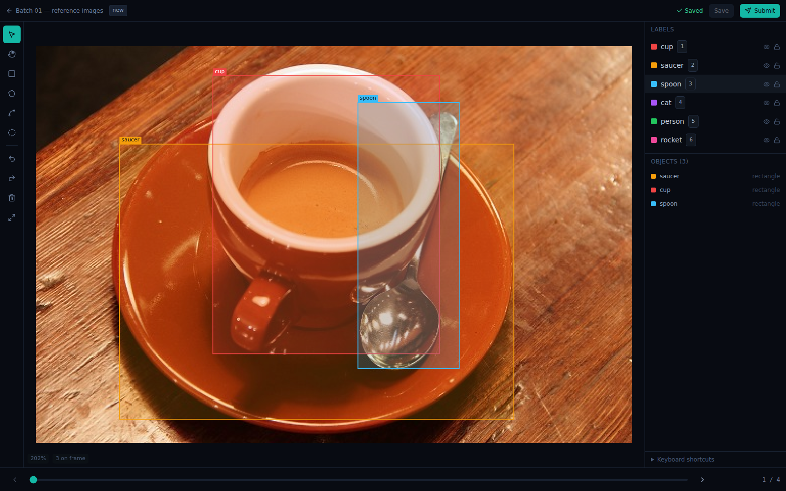
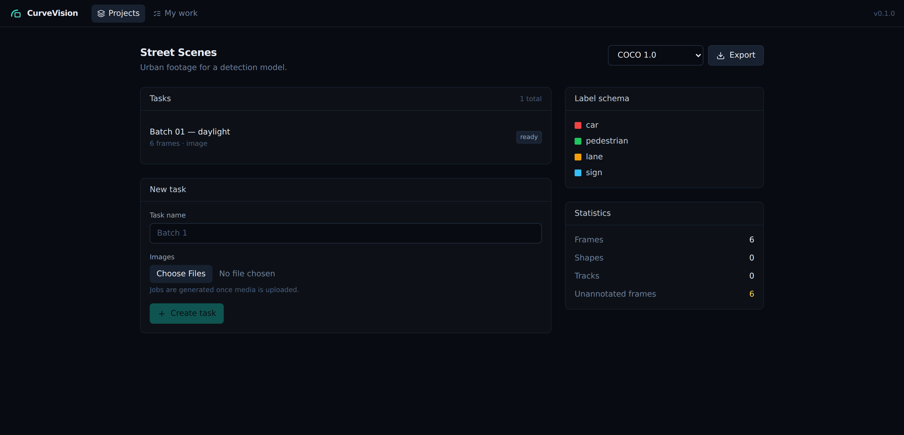

<div align="center">


# CurveVision

### Annotate computer-vision datasets on your own machine

**Install it and start drawing. Or run it for your team.
Same editor, same exporters, same code — your images never leave your infrastructure.**

[](https://github.com/Derric01/CurveVision/actions/workflows/ci.yml)
[](LICENSE)
[](server/pyproject.toml)
[](web/package.json)
[](docs/CONTRIBUTING.md)

[**Quick start**](#quick-start) · [Features](#what-it-does) · [Architecture](docs/ARCHITECTURE.md) · [API](docs/API.md) · [Roadmap](docs/ROADMAP.md) · [Contributing](docs/CONTRIBUTING.md)

</div>

<p align="center">
  
</p>

<div align="center"><sub>
The actual editor, photographed by <a href="scripts/screenshot.py"><code>scripts/screenshot.py</code></a> —
which drives the real application in a real browser and draws those boxes with real pointer events
on a real photograph. Nothing here is a mockup.
</sub></div>

---

## Why

You have a folder of images and you need a labelled dataset. Your options today are
usually a toy canvas that cannot do review or export properly, a cloud service that wants
your data, or an enterprise platform with a sales call attached to it.

CurveVision is the space in between.

<table>
<tr>
<td width="33%" valign="top">

### 🖥 &nbsp;It installs

Download, double-click, point at a folder, start drawing. No account, no server, no Docker,
no configuration file. Your images are annotated **where they already sit** — a 40 GB
folder on an external drive is not copied anywhere.

</td>
<td width="33%" valign="top">

### 👥 &nbsp;It scales to a team

The same application runs as a server: real accounts, roles, job assignment, a review
queue, issue threads, immutable dataset releases. The desktop app is not a cut-down
edition — it is this, configured differently.

</td>
<td width="33%" valign="top">

### 🔒 &nbsp;It stays yours

MIT licensed, self-hosted, no phone-home, no telemetry, no annotation limit, no feature
held back for a paid tier. Nothing in the core is withheld to sell you later.

</td>
</tr>
</table>

It does two things equally well, and **neither requires the other**:

```
Manual-first    upload → define labels → draw → review → export
AI-assisted     upload → run your model → accept or correct → review → export
```

> **Status: early, and honestly labelled.** The manual annotation path is complete and
> tested end to end. Video and the track-editing timeline are partly built. **Every feature
> below carries its real state** — nothing is marked Done unless it works and has tests. If
> you need a platform with years of production mileage behind it for critical work today,
> this is not yet that — and we would rather say so here than have you find out later.

---

## Quick start

### The desktop application

There are no signed installers yet — we would rather say so than link a download that does
not exist. Building it takes three commands:

```bash
pip install -e 'server[dev,media,desktop]'
npm --prefix web install && npm --prefix web run build
python desktop/sidecar/build.py          # one self-contained executable, then a smoke test
```

That alone gives you a complete CurveVision in a single file. Run it and open the URL it
prints — no configuration at all:

```bash
./desktop/sidecar/dist/curvevision-local
```

For the native window, build the Rust shell around it:

```bash
cd desktop/shell/src-tauri && cargo build --release
```

See [`desktop/`](desktop/) for what works today, what does not, and where your data lives.

### As a server

```bash
git clone https://github.com/Derric01/CurveVision.git
cd CurveVision

cp .env.example .env
python3 -c 'import secrets; print(secrets.token_urlsafe(48))'   # → CURVEVISION_SECRET_KEY

docker compose up -d
open http://localhost:8080
```

Six services from one command. No account, no license key. The first user you register
becomes the instance administrator.

### From source

```bash
./scripts/dev.sh      # infra in Docker, app on the host with hot reload
./scripts/check.sh    # everything CI runs, in one command
```

The whole server test suite runs on SQLite with an in-process queue and local files, so
you can clone and run `pytest` with no services installed.

---

## What it does

<table>
<tr><td width="50%" valign="top">

**Annotate**
Rectangles, polygons, polylines, points, ellipses. Keyboard-first, built for long
sessions. Undo is one press per gesture, not per pointer-move.

**Review**
Jobs as the unit of assignment, a real review state machine, issue threads anchored to a
frame and a shape. Nobody reviews their own work — the policy enforces it.

</td><td width="50%" valign="top">

**Accelerate**
Point it at any inference endpoint. Predictions arrive as suggestions you accept, edit or
reject. No bundled weights, no vendor SDK.

**Export**
Eleven formats — COCO, all five Ultralytics YOLO tasks (detection, segmentation, OBB, pose,
classification), Pascal VOC, KITTI, MOTChallenge, CVAT XML, segmentation masks and a
lossless native one — each declaring honestly what it can represent, *before* you rely on it.
**CVAT XML imports and exports**, so work done there is not stranded here.

</td></tr>
</table>

### Manual annotation — first class, not a fallback

| | |
| --- | --- |
| Rectangles, polygons, polylines, points, ellipses | **Done** |
| **Intelligent scissors** — click once and the boundary snaps to the edge under your cursor | **Done** |
| Selection, move, vertex editing, marquee | **Done** |
| Undo/redo with drag coalescing | **Done** |
| Zoom, pan, vertex snapping | **Done** |
| Per-label visibility and locking | **Done** |
| Crash-resilient autosave | **Done** |
| Track keyframes: add, remove and mark a departure from the timeline | **Done** |
| Masks — RLE storage and export exist; the brush tool does not | *Planned* |
| Skeletons / keypoints — model and COCO export exist; the UI does not | *Planned* |

**It stays fast.** The canvas is a Canvas2D engine with an R-tree spatial index, so
rendering costs what is *on screen* rather than what is in the dataset.

| Shapes in the dataset | Pick, with the R-tree | Pick, by linear scan | Gap |
| --- | --- | --- | --- |
| 10,000 | ~0.3 µs | ~450 µs | ~1,500× |
| 100,000 | ~0.7 µs | ~5,000 µs | ~7,000× |

One developer machine, and your numbers will differ — the shape will not, and the gap widens
with size. Run `npm run bench` in `web/` and check for yourself.

Autosave keeps a local write-ahead buffer in IndexedDB, so a browser crash does not cost
you an afternoon — and a stale write is rejected with a conflict rather than silently
merged over somebody else's.

### AI-assisted annotation — bring your own model

CurveVision ships **no model weights and imports no vendor SDK**. You point it at an
inference endpoint; predictions arrive as ordinary annotations.

```json
POST /your-endpoint
{ "model": "yolo-v8n", "frames": [{ "frame": 0, "width": 1920, "height": 1080, "image": "<base64>" }] }

← { "shapes": [{ "frame": 0, "label": "person", "type": "rectangle",
                 "points": [10, 20, 110, 220], "confidence": 0.93 }] }
```

That contract is a 30-line FastAPI script, and it is what Triton, TorchServe, BentoML, Ray
Serve and every hosted vendor already speak — which is the point. Bundling a serving
platform would force our choice on every operator and drag non-commercial model licenses
into the core.

Editing a prediction records `model_corrected` provenance, so your dataset knows which
objects a machine proposed and a human fixed. That distinction survives to export, and is
what makes an active-learning loop measurable.

| | |
| --- | --- |
| `ModelProvider` abstraction and the HTTP contract | **Done** |
| Predictions as accept/reject suggestions | **Done** |
| Provenance chain (`model` → `model_corrected`) | **Done** |
| Interactive segmentation (click-to-segment) | *Planned* |
| Trackers, OCR, classification model kinds | *Planned* |

### Datasets, review and release

<p align="center">
  
</p>

`Dataset → Version → Annotation → Review → Release`

A released version is immutable and carries a content hash, so *"which data trained this
model"* has an answer. Statistics surface class distribution and — the number people
actually need before training — **how many frames have no annotations at all**.

| | |
| --- | --- |
| Organizations, six roles, membership | **Done** |
| Jobs as the unit of assignment (parallel annotation on one task) | **Done** |
| Overlapping jobs merged on export — one object at a seam, not two | **Done** |
| Review state machine: `new → in_progress → submitted → accepted/rejected` | **Done** |
| Issues and comment threads anchored to a frame and shape, in the editor — open one on the selected object, reply, resolve, reopen | **Done** |
| Annotation history | **Done** |
| Immutable dataset releases with content hashing | **Done** |
| Content-addressed media (the same file across tasks is stored once) | **Done** |
| Export jobs with downloadable artifacts | **In Progress** |
| Ground-truth quality reports: declare a task's answer key, then score each job against it — precision/recall/F1 per label, classified conflicts, and a panel in the editor where clicking a conflict seeks to its frame | **Done** |

### Images and video

| | |
| --- | --- |
| Image datasets, dedupe, thumbnails, frame indexing | **Done** |
| Annotating local folders in place, without copying | **Done** |
| Video: frames decoded and served individually, so a video task is annotatable | **Done** |
| Client-side track interpolation (scrubbing costs no round trip) | **Done** |
| Chunked frame delivery — 36 frames decoded in one pass and fetched in one request, so stepping costs 17× fewer decodes and 12× fewer requests | **Done** |
| Track timeline — every track's keyframes and where it is present, `,`/`.` to step between them, `K`/`O` to add a keyframe or mark a departure, and drag a keyframe along its lane to move it | **Done** |
| Resumable uploads — storage model only; no endpoints yet | *Planned* |

Interpolation between keyframes resamples polygons to a common arc-length parameterisation
when vertex counts differ. Pairing vertices by index — the obvious implementation —
visibly scrambles a shape the moment an annotator inserts a vertex.

### Import and export

Four formats, each declaring **honestly** what it can represent:

| Format | Round-trips |
| --- | --- |
| **COCO** | rectangles, polygons, keypoints |
| **YOLO** | boxes, segmentation polygons |
| **Pascal VOC** | bounding boxes |
| **CurveVision JSON** | everything, losslessly |

An export that would drop annotations tells you **before** you rely on it — in a response
header and inside the archive. Silently dropping polylines is how people discover a broken
dataset during training, which is far too late.

Adding a format is one class and one `register()` call; third-party formats can register
through an entry point without touching this repository.

### API, SDK and CLI

Everything the UI does, a script can do — there is no private API surface.

```python
from curvevision_sdk import CurveVision

with CurveVision("https://curvevision.example.com", token="cv_...") as cv:
    task = cv.create_task(project.id, name="Batch 1")
    cv.upload(task.id, glob("frames/*.jpg"))
    cv.export(project.id, format="yolo", destination="dataset.zip")
```

```bash
curvevision login https://curvevision.example.com --username alice
curvevision task create <project-id> --name "Batch 1" --upload ./images/*.jpg
curvevision export <project-id> --format coco --output dataset.zip
```

OpenAPI 3.1 at `/api/v1/openapi.json`, generated from the same models that validate
requests — so it cannot drift from the implementation. Swagger UI at `/api/docs`.

---

## Architecture

```
  Browser ──┐
  SDK/CLI ──┼──▶  FastAPI (async)  ──▶  PostgreSQL
  CI      ──┘      │  policy · services · domain        Redis (cache + broker)
                   │  ┌────────┬─────────┬────────┐     S3 / MinIO
                   │  │storage │ formats │   ml   │
                   │  └────────┴─────────┴────────┘
                   └──▶ Dramatiq worker ──▶ your model server
```

A **modular monolith**: one API image, one worker image, module boundaries enforced by
explicit interfaces rather than network hops. `Storage`, `DatasetFormat`, `ModelProvider`
and `JobQueue` are the seams — swappable, and unit-testable with no database.

**Those seams are why the desktop app exists.** Swap PostgreSQL for SQLite, S3 for the
filesystem, and Redis for an in-process queue, and the same server runs on a laptop. Adding
the entire desktop application changed 1,460 lines and removed 42; nothing was rewritten.

| Decision | Reasoning |
| --- | --- |
| FastAPI + Pydantic v2 | One type declaration drives validation, OpenAPI, the SDK and the client types |
| SQLAlchemy 2.0 typed ORM | Real static typing over the domain; explicit transaction boundaries |
| Argon2id via `argon2-cffi` | The PHC winner and OWASP recommendation. `passlib` has been unmaintained since 2020, and auth is a poor place for stale code |
| In-process policy engine | The decision is a pure function of already-loaded rows. A second process and a policy language is a poor trade for self-hosters |
| Canvas2D + R-tree, not SVG | Rendering cost tracks the viewport, not the dataset |
| An HTTP inference contract, not a serving platform | Every serving stack already speaks it; model licenses stay on the operator's side |
| Streaming format registry | A server exporting 500k images cannot hold the dataset in memory |
| Tauri, not Electron | A 6.2 MB shell against ~150 MB, using the system webview |

* [ARCHITECTURE.md](docs/ARCHITECTURE.md) — the design, and an
  [OSS build-vs-extend table](docs/ARCHITECTURE.md#open-source-building-blocks--build-vs-extend-decisions)
  giving the reasoning for every dependency choice.
* [docs/adr/](docs/adr/) — the decisions, with the evidence behind them.

---

## Roadmap

**MVP is complete** — you can run CurveVision today, as a desktop application or a server,
and produce a real dataset with it.

**Beta** needs video annotation to be comfortable rather than merely working (chunked
delivery), the track-editing timeline, and webhook retries. **1.0** needs distributed rate
limiting, backup tooling and an external security review — we will not call a release 1.0
before that, because it would be a claim we cannot back.

Full detail, including what we have decided *against*, in [ROADMAP.md](docs/ROADMAP.md).
For where the project stands right now, [handoff.md](handoff.md) is the fastest read.

---

## Free and open source, without an asterisk

CurveVision's core is complete. There is no crippled edition, no feature held back to
create a paid tier, no annotation limit.

If commercial services ever exist around this project, they will be infrastructure —
managed hosting, support contracts, hosted inference — never the ability to annotate your
own data. Anything else would defeat the point of building it.

Licensed **MIT**. Self-host it, fork it, build a product on it.

---

## Contributing

Contributions of every size are welcome. Items marked **In Progress** in the roadmap have
settled designs and are the easiest places to start.

* [CONTRIBUTING.md](docs/CONTRIBUTING.md) — how to work on it
* [DEVELOPMENT.md](docs/DEVELOPMENT.md) — how to run it
* [CODE_OF_CONDUCT.md](CODE_OF_CONDUCT.md)
* [SECURITY.md](docs/SECURITY.md) — including a candid list of known limitations

```bash
./scripts/dev.sh      # infra in Docker, app on the host with hot reload
./scripts/check.sh    # everything CI runs
```

**Working on this with a coding agent?** [AGENTS.md](AGENTS.md) is the working contract for
any agent — Claude Code, Codex or otherwise — and [handoff.md](handoff.md) is the current
state and the next best action, updated every iteration.

---

## Community

* **Questions and ideas** — [GitHub Discussions](https://github.com/Derric01/CurveVision/discussions)
* **Bugs and features** — [Issues](https://github.com/Derric01/CurveVision/issues)
* **Security** — privately, per [SECURITY.md](docs/SECURITY.md)

If you use CurveVision for something, we would genuinely like to hear about it — what
worked, and more usefully, what did not.

---

## Acknowledgements

CurveVision stands on a decade of open-source work in this space, and we studied it
deliberately rather than rediscovering its lessons the expensive way.

**One file adapts MIT-licensed source from [CVAT](https://github.com/cvat-ai/cvat)**:
`server/curvevision/media/video.py`, for video frame decoding. It carries CVAT's copyright
header and is recorded in
[THIRD_PARTY_NOTICES](docs/THIRD_PARTY_NOTICES.md#adapted-source). Everything else here is
independently implemented, and we claim no affiliation with or endorsement by CVAT.ai
Corporation or Intel Corporation.

CurveVision is built on other people's well-maintained code, and that is the point. See
[THIRD_PARTY_NOTICES.md](docs/THIRD_PARTY_NOTICES.md) for every dependency, its license and
its authors.

---

<div align="center">

**Build better vision datasets.**

MIT licensed · [Derric01/CurveVision](https://github.com/Derric01/CurveVision)

</div>
